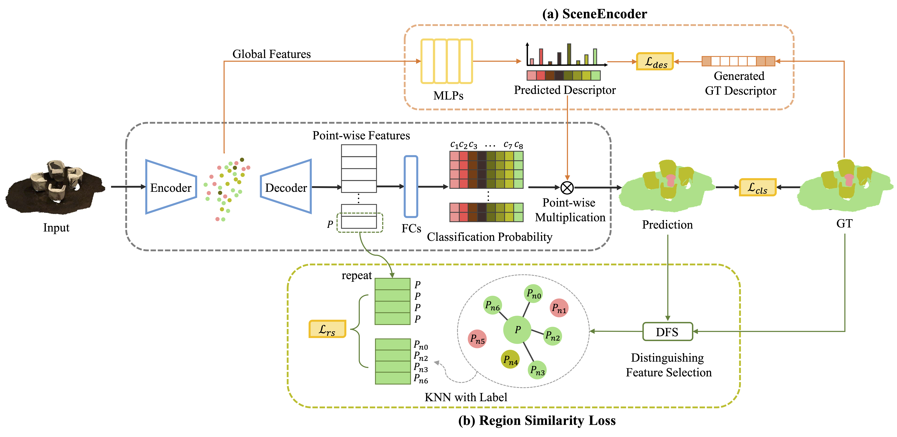

# SceneEncoder: Scene-Aware Semantic Segmentation of Point Clouds with A Learnable Scene Descriptor 
by Jiachen Xu*, Jingyu Gong*, Jie Zhou, Xin Tan, Yuan Xie and Lizhuang Ma.

<p align="center">  </p>

## Introduction
This project is based on our IJCAI2020 paper. You can find the [arXiv](https://arxiv.org/abs/2001.09087) version here.
```
@article{xu2020sceneencoder,
  title={SceneEncoder: Scene-Aware Semantic Segmentation of Point Clouds with A Learnable Scene Descriptor},
  author={Xu, Jiachen and Gong, Jingyu and Zhou, Jie and Tan, Xin and Xie, Yuan and Ma, Lizhuang},
  journal={arXiv preprint arXiv:2001.09087},
  year={2020}
}
```
Besides local features, global information plays an essential role in semantic segmentation, while recent works usually fail to explicitly extract the meaningful global information and make full use of it. In this paper, we propose a SceneEncoder module to impose a scene-aware guidance to enhance the effect of global information. The module predicts a scene descriptor, which learns to represent the categories of objects existing in the scene and directly guides the point-level semantic segmentation through filtering out categories not belonging to this scene. Additionally, to alleviate segmentation noise in local region, we design a region similarity loss to propagate distinguishing features to their own neighboring points with the same label, leading to the enhancement of the distinguishing ability of point-wise features. We integrate our methods into several prevailing networks and conduct extensive experiments on benchmark datasets ScanNet and ShapeNet. Results show that our methods greatly improve the performance of baselines and achieve state-of-the-art performance.

## Installation
The code is based on [PointNet](https://github.com/charlesq34/pointnet), [PointNet++](https://github.com/charlesq34/pointnet2) and [PointConv](https://github.com/DylanWusee/pointconv). Please install [TensorFlow](https://www.tensorflow.org/install/), and follow the instruction in [PointNet++](https://github.com/charlesq34/pointnet2) to compile the customized TF operators in the *tf_ops* directory. Specifically, you may need to check tf_xxx_compile.sh under each ops subfolder and modify ${CUDA_PATH} if necessary.

The code has been tested with Python 3.6, TensorFlow 1.13.1, CUDA 10.0 and cuDNN 7.3 on Ubuntu 18.04.

## Usage
### ModelNet40 Classification
Please check [pointconv_pytorch](https://github.com/DylanWusee/pointconv_pytorch) for details on Classification task on ModelNet40 using pytorch.

### ScanetNet DataSet Segmentation

Download the ScanNetv2 dataset from [here](http://www.scan-net.org/), and see `scannet/README` for details of preprocessing.

To train a model to segment Scannet Scenes:

```
CUDA_VISIBLE_DEVICES=0 python train_scannet_IoU.py --model pointconv_weight_density_n16 --log_dir pointconv_scannet_ --batch_size 8
```

After training, to evaluate the segmentation IoU accuracies:

```
CUDA_VISIBLE_DEVICES=0 python evaluate_scannet.py --model pointconv_weight_density_n16 --batch_size 8 --model_path pointconv_scannet_%s --ply_path DataSet/ScanNetv2/scans
```

Modify the model_path to your .ckpt file path and the ply_path to the ScanNetv2 ply file.

## License
This repository is released under MIT License (see LICENSE file for details).
